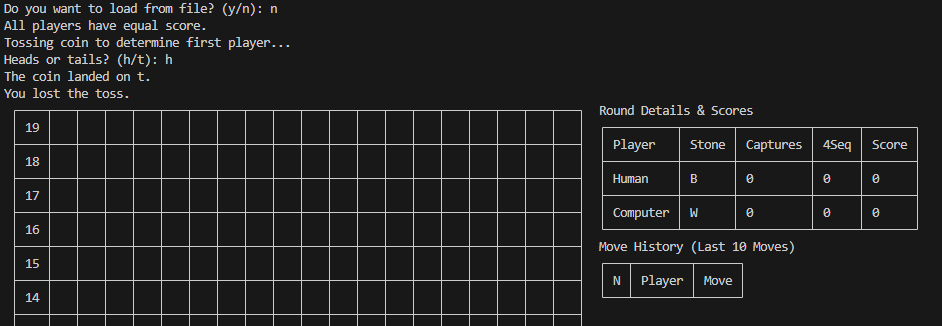
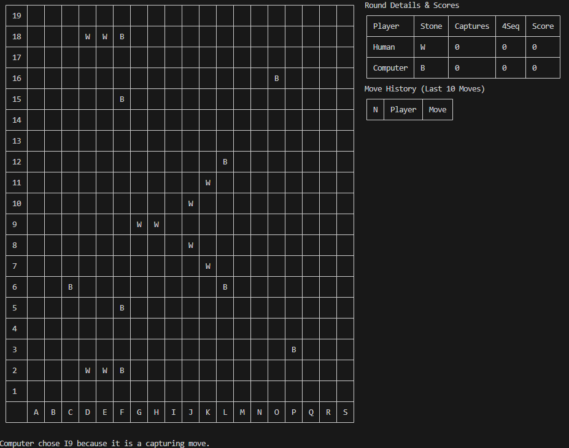
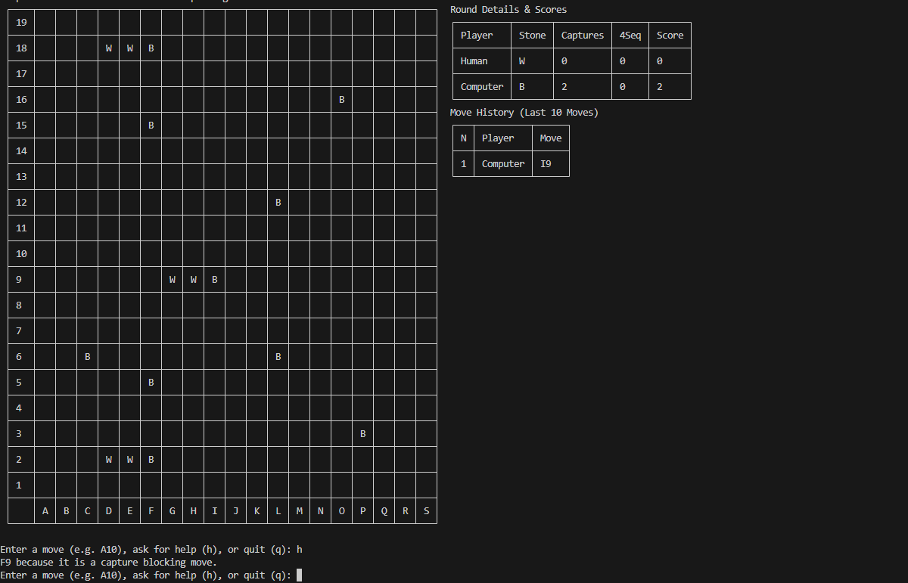
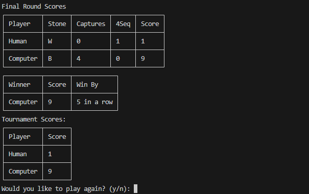
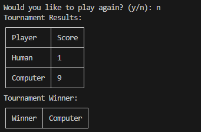

# Pente - C++

This project is a part of the CMPS 366, [Organization of Programming Languages](https://pages.ramapo.edu/~amruth/teaching/opl/f23/opl.html) (referred colloquially with a mixture of dread, resentment, and apprehension as "OPL"), course during Fall 2023 at Ramapo College of New Jersey. The same game is implemented in four different programming languages that are based on different paradigms: C++ (structured and object-oriented), Lisp (functional), Java/Android (object-oriented and event-driven for the GUI), and Prolog (logic). This is the C++ implementation of the game.

## Implementation in Other Paradigms

### [Functional - Lisp](https://github.com/bibhubhatta/cmps366-pente-lisp)

### [OOP & Event-Driven - Java/Android](https://github.com/bibhubhatta/cmps366-pente-java)

### [Logic - Prolog](https://github.com/bibhubhatta/cmps366-pente-prolog)

## Pente

Pente is a two-player board game that is played on a 19x19 board. The game is played with black and white stones. The objective of the game is to place five stones in a row, either horizontally, vertically, or diagonally. The game is played in turns, with each player placing one stone on the board per turn. The game ends when one player has five stones in a row, or when the board is full and no player has won. The player with five stones in a row wins the game.

## Requirements of the Project

### Objective

Win by placing at least five stones in an uninterrupted line or capturing five pairs of opponent's stones while scoring as many points as possible.

### Players

One human and one computer player, playing a tournament consisting of multiple rounds.

### Setup

19x19 board with intersections labeled by columns (A-S) and rows (1-19).

### First Player

Determined by a coin toss in the first round and by points in subsequent rounds.

### Turns

The first player places a white stone at the center (J10) on the first turn and another white stone at least 3 intersections away on the second turn. Players alternate turns thereafter.

### Capturing Stones

A player can capture a pair of opponent's stones if they place their stones on both sides of the opponent's stones in a row, column, or diagonal.

### End of Round

A round ends when a player places five stones in a row or captures five pairs of opponent's stones.

### Scoring

Points are awarded for placing five stones in a row, capturing pairs of opponent's stones, and placing four stones in a row.

### Tournament

The human player can choose to play another round or end the tournament. The winner is the player with the most points.

### Computer Strategy

The computer must have strategies for creating and countering initiatives.

### User Interface

Provide a user-friendly interface with ASCII graphics and command-line input. Validate all human inputs and display the computer's moves and strategies.

### Help Mode

The computer must provide recommendations for the human player's moves upon request.

### Serialization

Allow the game to be saved and resumed later by saving the current state to a text file.

More information of the project requirements can be found at [Professor Amruth Kumar's website](https://pages.ramapo.edu/~amruth/teaching/opl/projects/pente/problem.html).

## More Information

As part of the project, a report was submitted alongside the code. The report is available in DOCX format and can be accessed [here](docs/Submission%20Manual.docx). Some of the relevant sections are added below:

### Extra Features of the Project

#### Test-Driven Development

All non-I/O functionalities are implemented using a test-driven development (TDD) approach with full test coverage. The tests were written before the source code to ensure robust functionality. However, I did not test the UI implementation to avoid the complexities of automating console I/O.

#### Complete Interface Segregation

The project strictly follows interface segregation principles. All input and output operations are isolated from the game logic and tournament management. Output functionality is restricted to the Display classes (BoardDisplay, TournamentAnnouncement, RoundDisplay), while input is handled exclusively by the Human class. The `main.cpp` file manages additional I/O operations, such as reading and writing serial files to disk, handled by the Serial class for parsing. This modularity makes it easy to swap out interfaces, whether for a GUI, an alternate console setup, or different file formats.

#### Beautiful, User-Friendly, Informative Interface

The game interface displays the board in a tabular box format, supplemented with round details, scores, and a move history, providing a clear and intuitive user experience.

#### Configurable Board and Game Rules

The board is highly flexible, allowing customization of both its dimensions and the winning sequence length, supporting any m,n,k game configuration. The capture length of two stones is currently a fixed constant in the Board class, but it can be easily adapted to be variable. The system is fully functional with different board sizes, though reading serial files for non-standard sizes requires further adaptation.

#### Optimal Winning Move Strategy

When multiple winning moves are available, the program selects the one that yields the highest score. If all moves are equivalent, it defers the winning move to accumulate more points.

#### Efficient Initiative Planning

The game engine builds initiative by looking two moves (plies) ahead using a depth-first search. This selective approach focuses on adjacent cells of existing sequences, greatly speeding up the process and ensuring the initiative does not lead to capture. An exhaustive search was avoided due to performance constraints.

#### Robust Game State Management

The game state is encapsulated within the Board class, which operates independently of player or stone details. This design allows algorithms like minimax to operate with minimal parameters and prevents invalid game states. Moves are made by the Board class based on instructions from the Round class, ensuring no rogue player can perform invalid or multiple moves in a single turn.

#### No Invariant Violations

Variables like the current player are not directly stored, as the next player can be inferred from the number of pieces on the board and captured pairs. This design prevents synchronization bugs and ensures the game state is always consistent.

#### Versatile Pente Library

The project is structured as a library and an executable, making the core functionality reusable by other executables with different interfaces or logic. With minimal refactoring, the library could be adapted to support any m,n,k game.

#### Cross-Platform Compatibility

The project is designed to run on any operating system. It uses a platform-agnostic configuration defined in the CMakeLists.txt file, ensuring portability across different platforms.

#### Comprehensive Input Validation

All inputs, including serial files, undergo validation. Initially, invalid files were rejected. Now, the program provides an error message explaining the issue but loads the file regardless, allowing for greater flexibility in handling non-standard inputs.

## Screenshots

### First Player of the Round Being Determined

### Computer’s Move Explanation

### Computer Providing Help

### Winner of the Round Announced

### Winner of the Tournament Announced

## Description of Classes

<table>
<thead>
<tr>
<th><strong>Class</strong></th>
<th><strong>Description</strong></th>
</tr>
</thead>
<tbody>
<tr>
<td>Board</td>
<td>The board used for the game</td>
</tr>
<tr>
<td>Experimental Board</td>
<td>Inherits from Board — allows users to make invalid moves for analysis purposes</td>
</tr>
<tr>
<td>BoardDisplay</td>
<td>Renders the board in a tabular format with labeled positions</td>
</tr>
<tr>
<td>GameOver</td>
<td>Inherits from std::exception; thrown to indicate that the game is over</td>
</tr>
<tr>
<td>GameDrawn</td>
<td>Inherits from GameOver</td>
</tr>
<tr>
<td>GameWon</td>
<td>Inherits from GameOver</td>
</tr>
<tr>
<td>InvalidMove</td>
<td>Inherits from std::exception; thrown when an invalid move is attempted</td>
</tr>
<tr>
<td>Quit</td>
<td>Inherits from std::exception; thrown when a player decides to quit</td>
</tr>
<tr>
<td>MoveAnalysis</td>
<td>Analyzes a move, including whether it's a winning, capturing, capture-blocking, or win-blocking move</td>
</tr>
<tr>
<td>Player</td>
<td>Represents a player (virtual class)</td>
</tr>
<tr>
<td>Computer</td>
<td>Inherits from Player</td>
</tr>
<tr>
<td>Human</td>
<td>Inherits from Player</td>
</tr>
<tr>
<td>Position</td>
<td>Represents a position on the board; includes methods for string generation and distance calculations</td>
</tr>
<tr>
<td>Roster</td>
<td>Stores users and their scores for the tournament</td>
</tr>
<tr>
<td>Round</td>
<td>Represents a round in the game</td>
</tr>
<tr>
<td>RoundDisplay</td>
<td>Displays the board, details, and move history during a round</td>
</tr>
<tr>
<td>Serial</td>
<td>Parses and generates serial strings</td>
</tr>
<tr>
<td>Strategy</td>
<td>Determines which move to play, separated from the Player class to allow for multiple strategy types</td>
</tr>
<tr>
<td>Tournament</td>
<td>Represents the tournament</td>
</tr>
<tr>
<td>Tournament Announcement</td>
<td>Displays tournament results in a tabular format</td>
</tr>
</tbody>
</table>

### Data Structures

Data structures in lower case are from the standard library, while those in title case are custom classes.

<table>
<thead>
<tr>
<th><strong>Name</strong></th>
<th><strong>Description</strong></th>
</tr>
</thead>
<tbody>
<tr>
<td>BoardSequence</td>
<td>Stores full or partial parts of the board; evaluates to std::vector&lt;char&gt;</td>
</tr>
<tr>
<td>MoveHistory</td>
<td>Saves a player's move history; evaluates to std::vector&lt;std::pair&lt;Player*, Position&gt;&gt;</td>
</tr>
<tr>
<td>Analysis</td>
<td>Tuple to store move analysis, evaluating to: std::tuple&lt;int, int, int, int, int, int, Score, Score, int, std::string&gt;. Contains info on whether a move is winning, its impact on scores, capture potential, and more. Originally planned as a class but implemented as a tuple due to time constraints.</td>
</tr>
<tr>
<td>priority queues</td>
<td>Stores moves and scores for different move types. This was replaced with a single tuple to simplify the logic.</td>
</tr>
<tr>
<td>StrategicMove</td>
<td>Evaluates to std::pair&lt;Position, std::string&gt;; the second value explains the rationale behind the move</td>
</tr>
<tr>
<td>map</td>
<td>Used to map players to stones, stones to captured pairs, and players to scores</td>
</tr>
<tr>
<td>vector</td>
<td>Used to store various data structures; no arrays were used</td>
</tr>
<tr>
<td>set</td>
<td>Returns lists of moves, such as available, winning, or capturing moves</td>
</tr>
<tr>
<td>Table</td>
<td>Represents the board, scores, and move history for display (from the "tabulate" library)</td>
</tr>
<tr>
<td>Graph</td>
<td>Not explicitly implemented, but graph algorithms are used in MoveAnalysis and Board for certain methods</td>
</tr>
</tbody>
</table>
